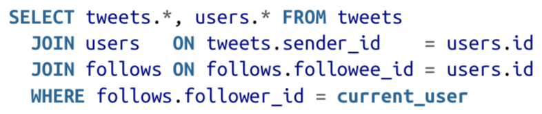
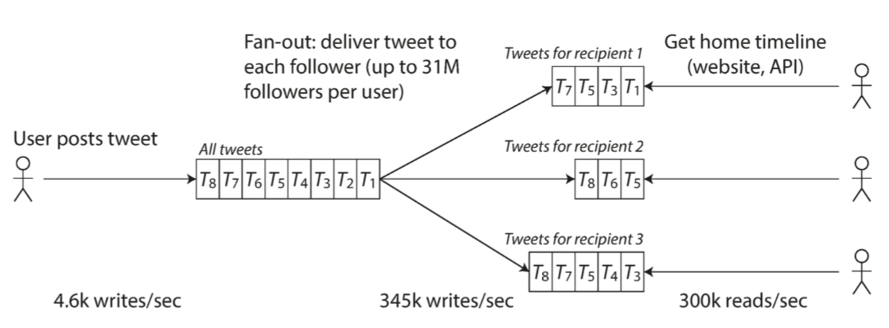

# Chapter 1: Reliable, Scalable and Maintainable Applications

## I. Think aboue Data Systems
  * Many new tools for data storage and processing have emerged in recent years, and they no longer nearly fit into traditional categories.
  * Demanding and wide-ranging requirements that a single tool can no longer meet all its data processing and storage needs.
  * The three concerns in this book:
    * Reliability: Continue to work correctly even in the face of adversity.
    * Scalability: Reasonable ways of dealing with growth.
    * Maintainability

## II. Reliability
  * Fault tolerant: Continue to work correctly even when things go wrong.
  * Fault: One component of the system deviating from its spec.
  * Failure: The system as a whole stops providing the required service to the user.

### Hardware Faults
  * Some statistics: On a storage cluster with 10,000 disks, we should expect on average one disk to die per day.
  * The system should the loss of entire machines by using software fault-tolerance techniques.

### Software Errors
  * Systematic error within the system and correlated across nodes.
  * Cause many more system failures that uncorrelated hardware failures.

### Human Errors
  * The best systems combine several approaches:
    * Design systems in a way that minimizes opportunities for error.
    * Decouple the places where people make the most mistakes.
    * Test thoroughly at all levels.
    * Allow quick and easy recovery from human errors.
    * Set up detailed and clear monitoring (telemetry).
    * Implement good management practices and training.

## III. Scalability
### Describing Load
  * Load parameters: Request per second to a web server; the ratio of reads to writes to a database; # of simultaneously active users in a chat room; the hit rate on a cache.
  * Case study: Twitter
    * Twitter's scalling challenge -- **Fanout**: each user follows many people, and each user is followed by many people.
    * Method 1: Posting a twitter insert the new tweet into a global collection of tweets. When user requesting their home timeline, lookup the people they follow, find all the tweets from those users and merge them (sorted by time). Please refer to the sample SQL below for illustration.\
      \
      Drawback: The system struggles to keep up with the load of home timeline queries.
    * Method 2: Maintain a cache for each user's home timeline. When a user post a new tweet, lookup all of his/her followers, insert the new tweet into each of their home timelines cache. The following diagram illustrate the logic behind this.\
      \
      Drawback: Donald Trump has more than 80 million followers. A single of his tweet results 80 million writes to home timelines. And he tweets a lot.
    * Final solution: Most users' tweets continue to be fanned out to home timelines. A small number of users with large number of followers (For example, Donald Trump or Taylor Swift) are excepted from the fan-out. 

### Describing Performance
  * Throughput - # of records we can process per second / the total time it takes to run a job on a dataset of a certain size.
  * Response time - The time between a client sending a request and receiving a response. We care about distribution of values. We care about the following statistics for Response time - average, median and tail latencies (High percentiles of response times).
  * Queueing delay accounts for a large part of response time at high percentiles.

### Approaches for Coping with Load
  * Scaling up - Moving to a more powerful machine.
  * Scaling out - Distributing the load across multiple smaller machines. Taking a stateful data systems from a single node to a distributed setup can introduce a lot of complexity.
  * Elastic - Automatically add computing resources when detecting a load increase.

## IV. Maintainbility
  * Operability - Keep the system running smoothly.
  * Simplicity - Make it easy for new engineers to understand the system.
    * Abstraction - Hide a great deal of implementation detail behind a clean, simple to understand facade.
  * Evolvability - Make it easy for engineers to make changes to the system in the future.