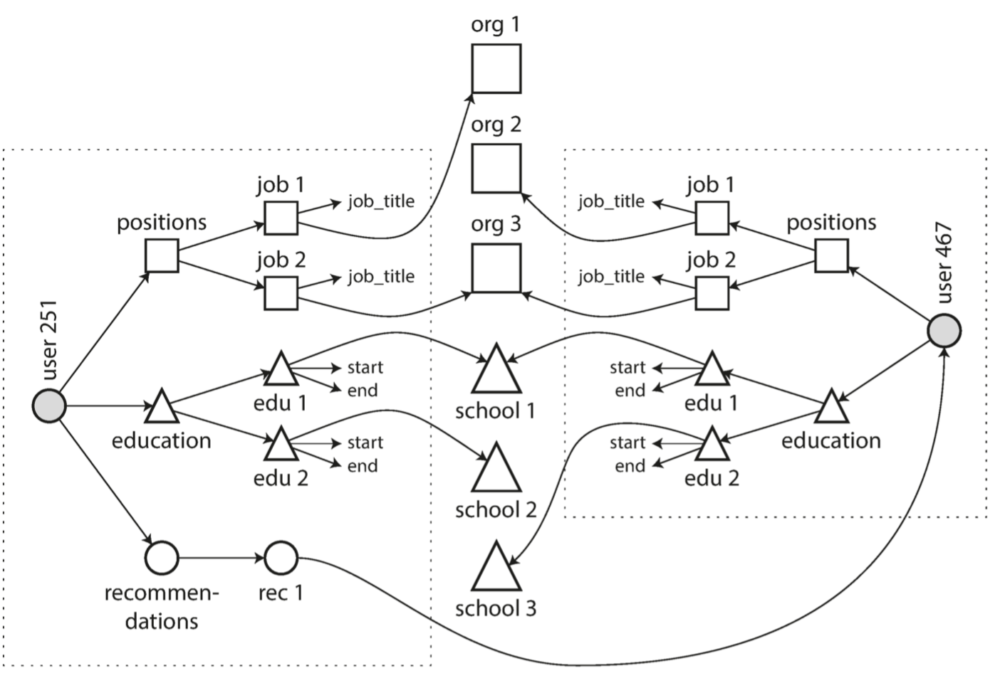
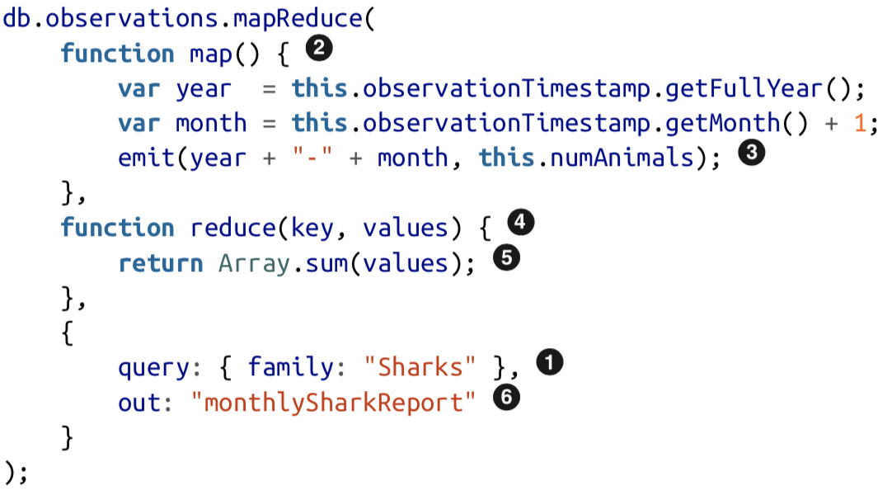
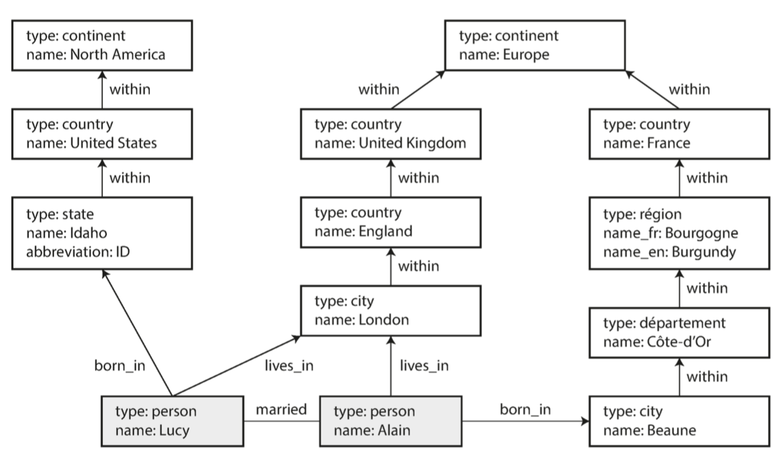
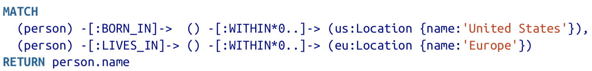
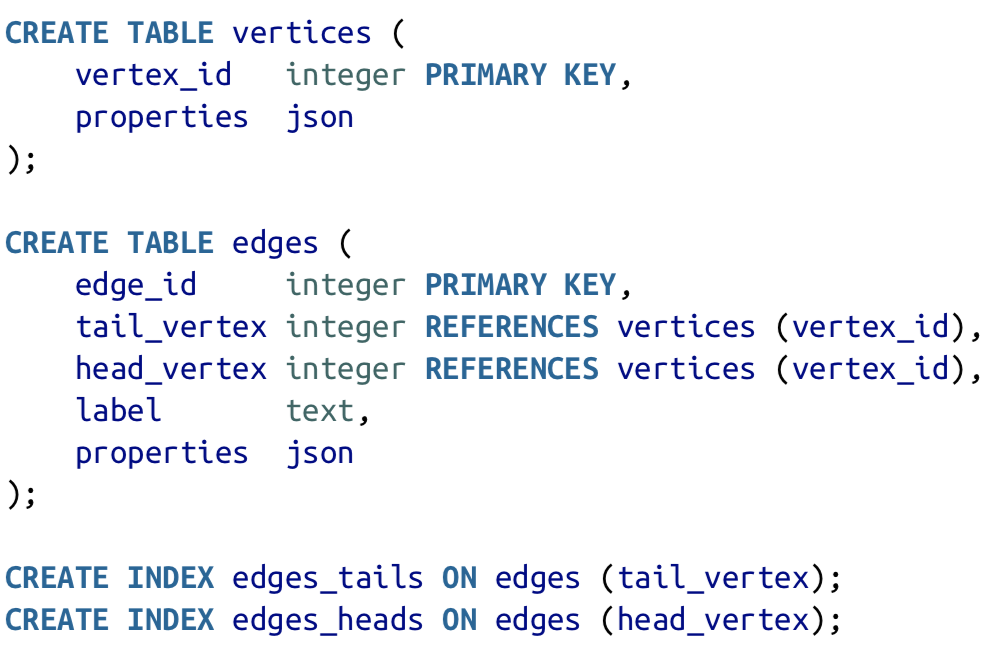
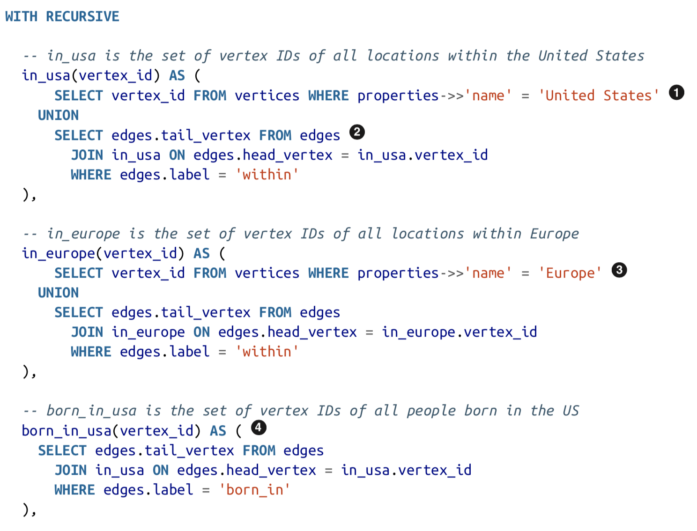
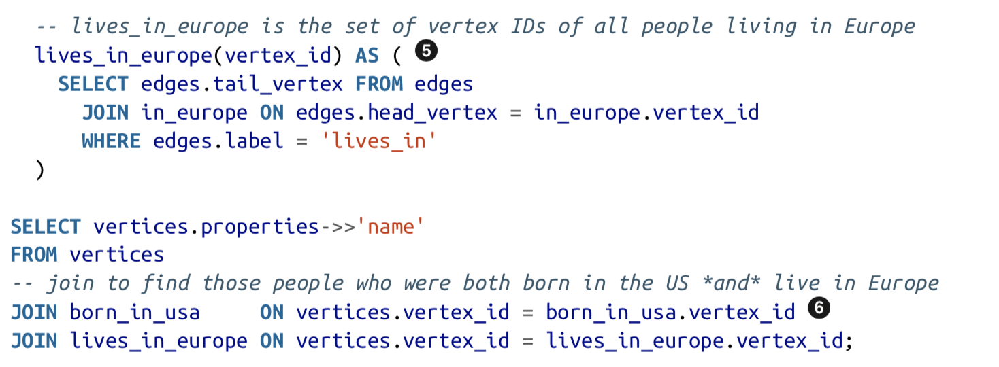
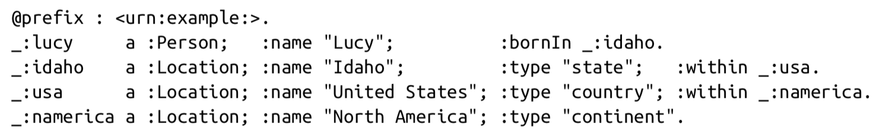
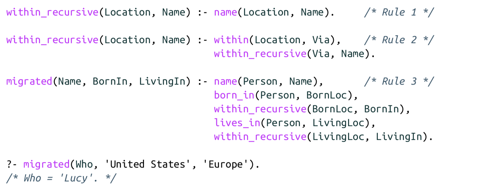

# Chapter 2: Data Models and Query Languages

## I. Relational Model Versus Document Model
  * Concept for Relational Model: Data is organized into relations (called tables in SQL), where each relation is an unordered collection of tuples (rows in SQL).
### The Birth of NoSQL
  * Several driving forces behind the adoption of NoSQL are:
    * A need for greater scalability than relational databases
    * Preference for free and open source software
    * Specialized query operations not well supported by SQL
    * Frustration with the restrictiveness of relational schemas
### The Object-Relational Mismatch
  * Impedance mismatch: An awkward translation layer (Something like Object-Relational Mapping (ORM) framework) is required between the objects in the application code and the database model of tables, rows and columns.
  * An option is to encode information as a JSON or XML document, store it onto a text column in the database.
  * The JSON/XML representation has better locality than the multi-table schema option, becase JSON/XML makes the one-to-many relationships (tree structure) explicit.
### Many-to-One and Many-to-Many Relationships
  * Approach: having standardized lists of geographic regions and industries (in the example of LinkedIn profile) and let users choose from a drop down list or autocomplete. Advantages:
    * Consistent stype and spelling across profiles
    * Aviod ambiguity
    * Ease of updating
    * Localization support
    * Better search
  * The standardized lists will be a hashmap from ID to text, by doing this, we expect to remove duplication when information (locations or industries) are the same in multiple places. This is called Normalization Many-to-One relationship in the database.
  * Data has a tendency of becoming more interconnected as feature are added to applications, which require many-to-many relationships. The image below illustrates how many-to-many relationship looks like in the LinkedIn profile data model.\
    
### Are Document Databases Repeating History?
  * How to best represent many-to-many relationships and joins in document databses and NoSQL?
  * The Network Model -- Conference on Data System Languages (CODASYL Model)
    * A record can have multiple parents.
    * Links between records in the network model are more like pointers in a programming language than foreign keys in SQL.
    * An access path -- Follow a path from a root record along these chains of links to access a record.
    * Query in CODASYL -- Move a cursor through the database by iterating over lists of records and follow access path.
  * The Query Model (SQL) -- The query optimizer automatically decides which parts of the query to execute in which order, and which indexes to use.
### Relational Versus Document Databases Today
  * Advantages of both database models
    * For Document Database: Schema flexibity, better performance due to locality, and closer to data structure used by the application. 
    * For Relational Database: Better support for joins, many-to-one and many-to-many relationships.
  * Which data model leads to simpler application code?
    * Better to use Document Database if the data in the application has a document-like structure in order to avoid shredding (splitting a document-like structure into multiple tables).
  * Schema flexibility in the document model
    * JSON does not enforce any schema. XML support in relational databases usually comes with optional schema validation.
    * No schema means that clients have no guarantees as to what fields the documents may contain.
    * Document databases assumes an implicit schema which is not enforced by the database.
    * Schema-on-read and schema-on-write
      * Schema-on-read: The structure of the data is implicit, and only interpreted when data is read. Similar to dynamic (runtime) type checking. Schema-on-read is advantageous if the items in the collection don't have the same structure for some reason.
      * Schema-on-write: Schema is explicit and the database ensures all written data conforms to it. Similar to static (compile-time) type checking.
        * Schema changes on Relational database (SQL). Running the `UPDATE` statement on a large table is likely to be slow.
  * Data locality for queries
    * Data locality is advantageous if you need large parts of the document at the same time.

## II. Query Languages for Data
  * Imperative language: Perform certain operations in a certain order.
  * Declarative query language: Specify the pattern of the data you want, and how you want the data to be transformed. Hide implementation details of the database engine and lend themselves to parallel execution.
### Declarative Queries on the Web
  * CSS and XSL are both declarative languages for specifying the styling of a document.
### MapReduce Querying
  * An example would be MongoDB's MapReduce feature. Please refer to the following example (filter the observations to only show species in the sharp family):\
    
    * The filter considers only `Sharks` species.
    * `map` is called once for document that matches the query.
    * The `map` function emits a <key, value> pair.
    * The <key, value> pairs emitted by `map` are grouped by key.
    * `reduce` function adds up the number of animals in a particular month.
    * The final output is written to `monthlySharkReport`.
  * The `map` and `reduce` functions must be pure functions which only use data passed to them as input. They cannot perform additional database pueries and must not have any side effects.
  * The moral of the story is that **a NoSQL system may find itself accidentally reinventing SQL**.

## III. Graph-Like Data Models
  Example graph used in this section\
  

### Property Graphs
  * Vertex information
    * A unique identifier
    * A set of outgoing/incoming edges
    * A collection of properties (<key, value> pairs)
  * Edge information
    * A unique identifier
    * The vertex at which the edge starts (the tail vertex) and the edge ends (the head vertex)
    * A label to describe the relationship between the two vertices
    * A collection of properties (<key, value> pairs)
  * Properties of Property Graphs
    * Any vertex can have an edge connecting it with any other vertex. No schema is required.
    * Given any vertex, you can efficiently find both is incoming and outgoing edges, and thus traversing the graph.
    * By using different labels for different kinds of relationships, we can store several different kinds of information in a single graph, while maintaining a clean data model.
### The Cypher Query Language
  * Declarative Query Language for property graphs
  * Example: Find names of all the people who immigrated from the United States to Europe.
  * Solutions:\
    
    * (1) Find all `person` vertices whose outgoing `BORN_IN` edge chain leads to a `location` vertex whose property is United States.
    * (2) Find all `person` vertices whose outgoing `LIVE_IN` edge chain leads to a `location` vertex whose property is United States.
    * For all `person` vertices who matches both (1) and (2), return their `name` property value.
### Graph Queries in SQL
  * We can represent the GraphModelExample image above in the following SQL schema.\
    
  * The SQL for the same example above looks like\
    
    
### Triple-Stores and SAPRQL
  * Triple-Store: All information are stored in a three-part statements: <subject, prediacate, object>. Subject is a vertex in a graph.
    * If object is a primitive datatype. <prediacate, object> is a <key,value> pair.
    * If object is another vertex. prediacate is an edge in the graph, subject is the tail vertex and object is the head vertex.
  * Triple-Store example:\
    
  * Resource Description Framework (RDF): A mechanism for different websites to publish data in a consistent format, allowing data from different websites to be combined into a web of data. RDF sometimes is written in an XML form.
  * SAPRQL is a query language for triple-stores using the RDF data model.
### The Foundation: Datalog
  * Triple is expressed as `prediacate(subject, prediacate)`. And we can express the query example above as\
    
    * We define rules (`with_recursive` and `migrated`) as new predicates. And combine different predicates into blocks of logic that finds all people born in United States and live in Europe.