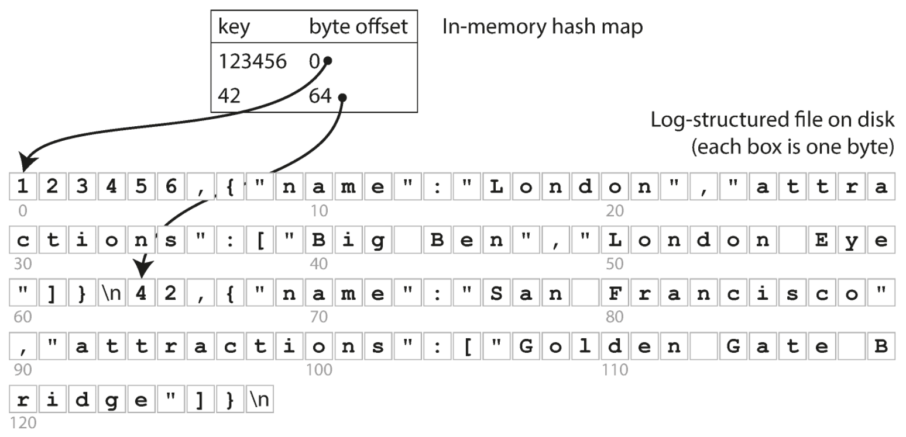
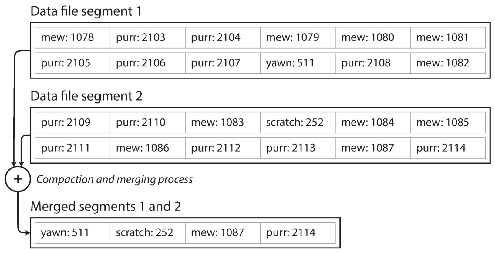
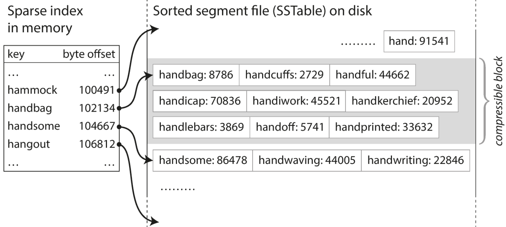
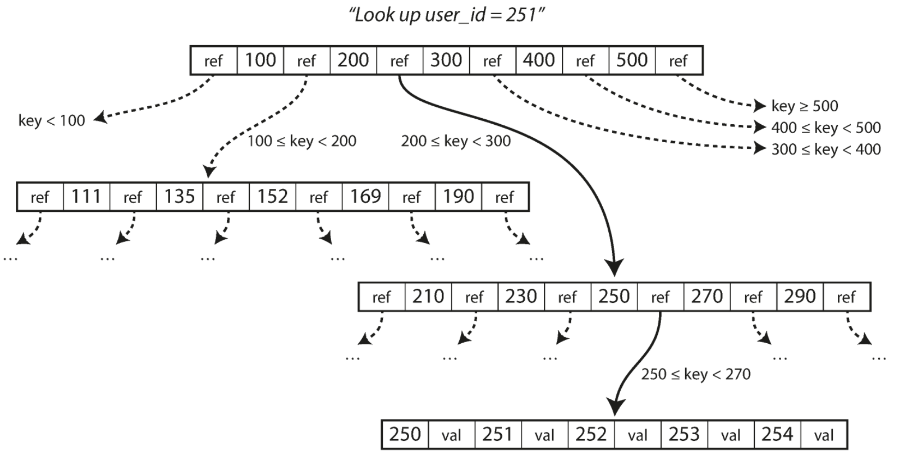
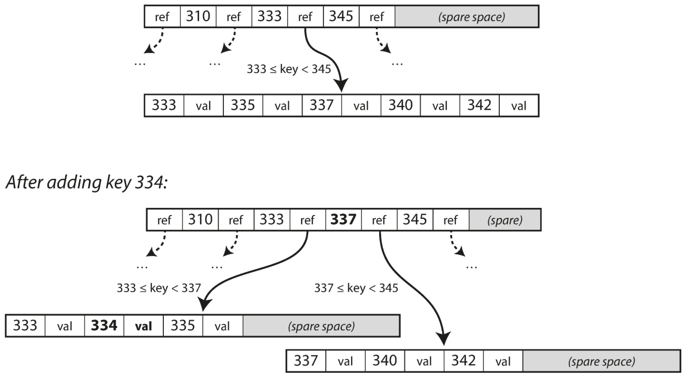
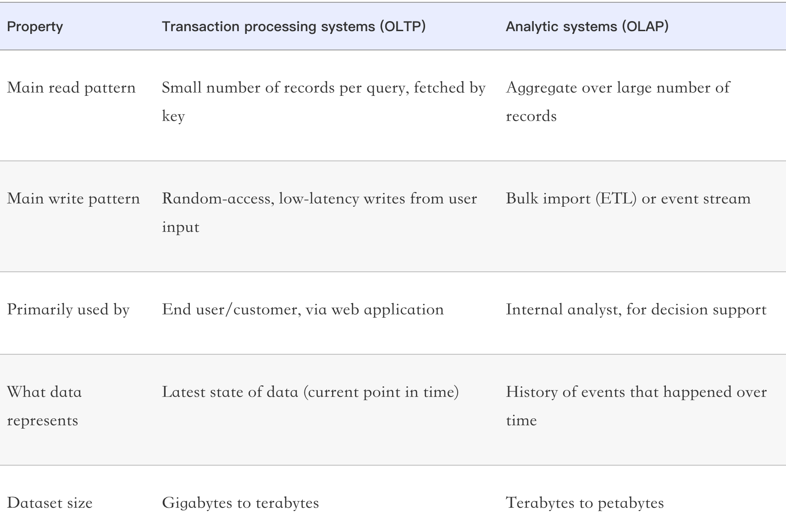
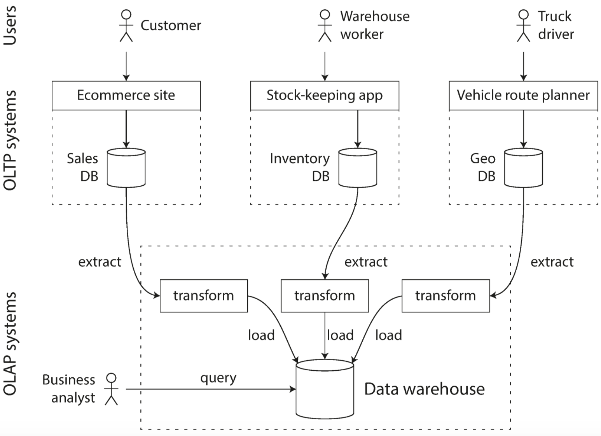
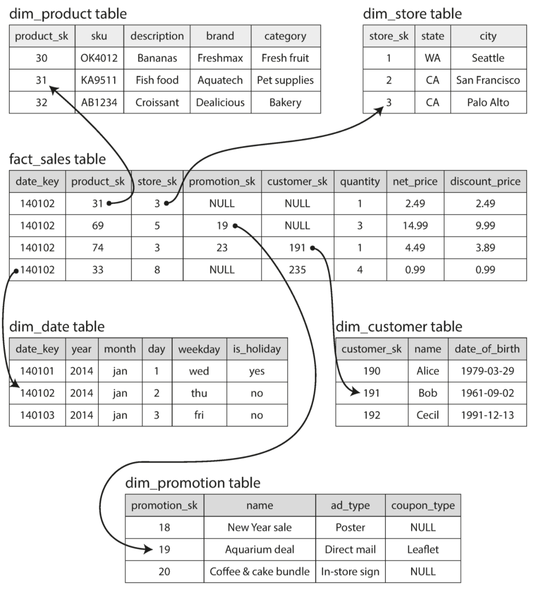
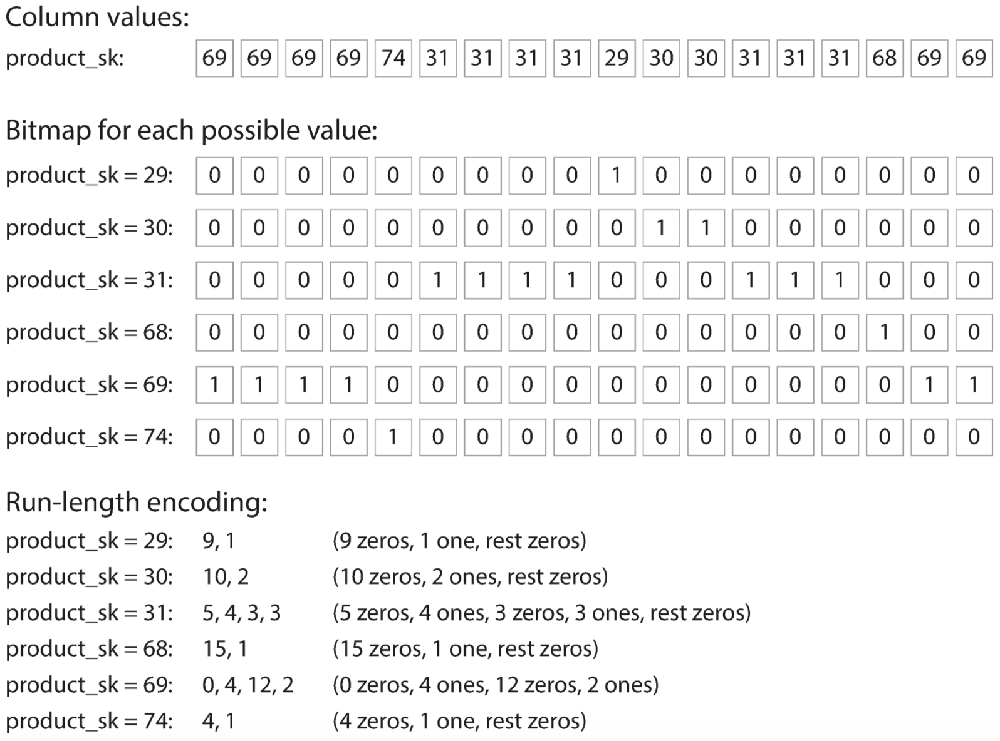
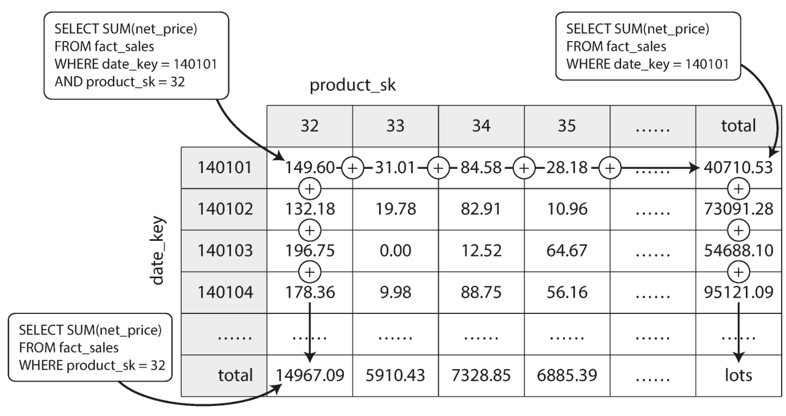

# Chapter 3: Storage and Retrieval

General Idea of this chapter: How we can store the data we are given, and how we can find it again when we are asked for it.

## 1. Data Structures That Power Your Database
The simplest database with `db_get()` and `db_set()` functions in bash.
```bash
#!/bin/bash
db_set () { echo "$1,$2" >> database }
db_get () { grep "^$1," database | sed -e "s/^$1,//" | tail -n 1 }
```
* Similar to the simplicity of `db_set()`, many databases internally user a log, which is an append-only data file.
* The cost of db lookup (`db_get()`) is O(n), so we want to introduce index in this chapter, acting as a signpost and help you to locate the data.
* An important trade-off: **Well chosen indexes speed up read queries, but every index slows down writes**

### 1.1 Hash Indexes
* Simplest Indexing Strategy: **keep an in-memory hash map where every key is mapped to a byte offset in the data file**. Please refer to illustration below.\
  
* An example of this model is Bitcask and the situation is where the value for each key is updated frequently.
* How do we avoid eventually running out of disk space? Please pay attention to the following points with regarding to this issue. 
  * General Strategy: Break the log into segments of a certain size by closing a segment file when it reaches a certain size, and make subsequent writes to a new segment file.
  * Compaction: Throw away duplicate keys in the log, and keep only the most recent update for each key.
  * We can also merge several segments at the same time as performing compaction. Merging and compaction can be done in a background thread. 
    * We can still read into the old segment files and write request to the latest segment file.
    * After merging and compaction is complete, we swtich the read request to the new merged segment and the old segment files can be deleted.
  * Please refer to illustration below for how compaction and merge works.\
    
  * Each segment keeps its own hash table, mapping keys to file offsets.
* Implementing Details:
  * File format: Use a binary format that first encodes the length of the string followed by the raw string.
  * Delete Record: Append a special delete record to the datafile (**tombstone**), when deleting, discard all previous values for the deleted key.
  * Crash Recovery: Store a snapshot of each segment's hash map on disk, which can be loaded to memory more quickly.
  * Partially Written Record: Include checksum so that corrupted parts of the log can be detected and ignored.
  * Concurrency Control: Only one write thread, but allow multiple concurrent read threads.
* Benefit of append-only design:
  * Appending and segment merging are sequential write operations, which are much faster than random writes.
  * Concurrency and crash recovery are mush simpler.
* Limitations of hash table index:
  * Too many hash keys will be out of memory.
  * Range queries are not efficient.

### 1.2 SSTables and LSM-Trees
* From now on, we begin to require the sequence of key-value pairs to be **sorted by key**. We define this data structure as **Sorted String Table (SSTable)**.
* Advantage of using SSTables:
  * Merging segments is simple and efficient, since the strategy behind this is very similar to mergesort algorithm.
  * Do not need to keep an index of all the keys in memory. Just need some indexes which can be sparse.
  * We can group and compress records into a block before writing it to disk, each entry of the sparse in-memory index points at the start of a compressed block.\
    

#### 1.2.1 Constructing and Maintaining SSTables
* When a write request comes, add it to a in-memory balanced tree structure (red-black tree or AVL tree), which serves as a memtable.
* If a memtable reaches a threshold, store the memtable into the newest segment file of the database. Write request can continue to a new memtable instance.
* When read request comes, it will start from the in-memory memtable to most recent on-disk segment file, then in the next order segment, etc.
* A background thread will keep running a merging and compaction process.

#### 1.2.2 Making an LSM-Tree out of SSTables
* Storage engines that are based on merging and compacting sorted files are often called LSM storage engines.

#### 1.2.3 Performance Optimizations
* Looking up keys that do not exist in the database can be slow. So additional Bloom Filter is usually implemented in order to tell whether a key exists in the database or not.
* Basic idea of LSM-Tree is to **keep a cascade of SSTables that are merged in the background**. Two different compaction strategies:
  * Size-tiered compaction: newer and smaller SSTables are merged into older and larger ones.
  * Leveled compaction: key range is split up into smaller SSTables and older data is moved to "separate" levels. This allows compaction to be more incremental and use small disk size.

### 1.3 B-Trees
* B-Trees break the database down into fixed-size blocks or pages, and read or write the one page at a time.
* Each page can be identified using an address or location, allowing one page to refer to another.
* The following image illustrates looking up a key using a B-Tree index.\
  
* Please keep in mind the following concepts:
  * **Root Page**: whenever you want to look up a key in the index, you start from here. Each child is responsible for a continuous range of keys, keys between the references where the boundaries between those rages lie.
  * **Leaf Page**: A page containing individual keys and pages where the values can be found. 
  * **Balancing Factor**: The number of references to child pages in one page of the B-Tree.
* The following image illustrates growing a B-Tree by splitting a page.\
  

#### 1.3.1 Making B-Trees Reliable
* The write operation of a B-Tree is to overwrite a page on disk with new data. And thus, the underlying assumpation is that **the overwrite does not change the location of the page**.
* Problem: Database crashes after only some pages have been written (in the process shown in the image above) will end up with a corrupted index.
* Solution: Include an additional **write-ahead log** data structure that will record each B-Tree modification before the operation can be applied to the pages of the tree itself. The log can be used to restore B-Tree back to a consistent state.

#### 1.3.2 B-Tree Optimizations

### 1.4 Comparing B-Trees and LSM-Trees
* Generally speaking, **LSM-Trees are typically faster for writes, whereas B-Trees are thought to be faster for reads**.

#### 1.4.1 Advantages of LSM-Trees
* Definition of **Write Amplification**: One write to the database results in multiple writes to the disk over the course of the database's lifetime.
* In write heavy application, Write Amplification have a direct performance cost: the more that a storage engine writes to disk, the fewer writes per second it can handle within the available disk bandwidth.
* LSM-Trees have lower write amplification, and thus are able to sustain higher write throughput than B-Trees.
* LSM-Tree can be compressed better, and thus often produce small files on disk than B-Trees.

#### 1.4.2 Downsides of LSM-Trees
* The compaction process can sometimes interfere with the performance of ongoing reads and writes (A request needs to wait while the disk finishes an expensive compaction process).
* The finite write bandwidth needs to be shared between the initial write and the compaction threads running in the background. The bigger the database gets, the more disk bandwidth is required for compaction.
* It is likely that compaction does not keep up with the rate of incoming writes, which will lead to run out of disk space and reads slowing down.
* Advantage of B-Tree: key exists in one place in the index, offering strong transaction isolation (locks can be directly attached to the three).

### 1.5 Other Indexing Structures
* Use **Secondary Indexes** for performing joins efficiency.

#### 1.5.1 Storing Values Within the Index
* Most common situation: Values can be reference to a heap file, this will avoid duplicating data when multiple secondary indexes are present.
  * Might have problem when updated value is larger which requires new enough space. 
    * **[Solution]**: (1) write the value in a new location and update all indexes; (2) A forward pointer left behind in the old heap location.
* **Clustered Index**: Stores an index row directly within an index (Usually Primary Key). Secondary indexes refer to the primary key.
* **Covering Index**: Stores some of the table's columns within the index.

#### 1.5.2 Multi-Column Indexes
* One example would be geospatial data, we will transfer to use specialized spatial indexes such as R-Tree.

#### 1.5.3 Full-Text Search and Fuzzy Indexes

#### 1.5.4 Keeping Everything in memory
* In Memory Database -- Keep entirely in memory, distributed across several machines.
* When in-memory database is restarted, it needs to reload its state either from disk or over the network from a replica.
* Reason for performance advantage: they can be faster because they can avoid the overhead of encoding in-memory data structures in a form that can be written to the database.
* In-memory database can provide different data models compared to disk-based indexes. (Redis offers priority queues and sets)
* Support datasets larger than available memory without bringing back the overheads of a data-centric architecture. (Evict the least recently used data from memory)

## 2. Transaction Processing or Analytics
* **Online Transaction Processing (OLTP)**: Look up a small number of records by some key, using an index. Records are inserted or updated based on the user's input.
* **Online Analytic Processing (OLAP)**: Queries are written by business analysts, and feed into reports for business intelligence.
* Please refer to the table below for comparison between OLTP and OLAP:\
  

### 2.1 Data Warehousing
* OLTP systems are expected to be highly available and to process transaction with low low latency; and are usually relunctant to let business analysts run expensive analytic queries on it.
* Data Warehouse: Data is extracted out of OLTP Systems, transformed into an analysis-friendly schema, cleaned up and loaded into data warehouse. (**Extract - Transform - Load, ETL**). Please refer to the image below for an illustration of ETL.\
  

### 2.2 The Divergence between OLTP Databases and Data Warehouses
* On the surface, a data warehouse and a relational OLTP database look similar, both have a SQL query interface.
* Internally, they are optimized for very different query patterns, either supporting transaction processing or analytics workload, but not both.

### 2.3 Stars and Snowflakes: Schemas for Analytics
* **Star Schema**: At the center of the schema is a so-called fact table, each row represents an event that occurred at a particular time. Fact tables are usually extremely big, with several hundred columns.
* **Dimensions Table**: Columns in the fact table usually have foreign key references to other tables.
* Please refer to the following diagram for an illustration of Star Schema.\
  

## 3. Column-Oriented Storage
* A row-oriented storage engine needs to load all of those rows from disk, parse them and filter out those not meeting requirements, which is expensive.
* **Column Oriented Storage**: Store all the values from each column together and each column contains the rows in the same order, so that each columns is stored in a separate file and a query only needs to read and parse those columns.

### 3.1 Column Compression
* We will use **bit-map** encoding. If n is very big, the bigmaps can be run-length encoded. Please refer to the image below for illustration.\
  
* **Memory Bandwidth and Vectorized Processing**: Column compression allows more rows from a column to fit in the same amount of L1 cache. Operators (AND/OR) can be designed to operate directly on such chunks of compressed column data.

### 3.2 Sort Order in Column Storage
* The data needs to be sorted an entire row at a time, the administrator of the database can choose the columns by which the table should be sorted. And a second column can determine the sort order of any rows that have the same value in the first column.
* Advantage: Help compression of columns with a simple run-length encoding. The compression effect is strongest on the first sort key.

### 3.3 Writing to Column-Oriented Storage
* Use a similar approach as LSM-Tree: all writes first go to an in-memory store, where they are added to a sorted structure and prepared for writing to disk. When enough writes have accumulated, they are merged with the column files and written to new files in bulk.

### 3.4 Aggregation: Data Cubes and Materialized Views
* **Materialized Views**: A table-like object whose contents are the results of some query and it is an actual copy of the aggregate query results.
  * Frequent update to Materialized Views is expensive so it is not often used by OLTP Databases.
* **Data Cube**: A group of aggregates grouped by different dimensions. Please refer to the two-dimensional data cube grid below, each cell represents for the aggregate of an attribute of all facts with that date-product combination.
  
  * Advantage: Certain queries become very fast.
  * Disadvantage: A data cube does not have the same flexibity as querying the raw data.